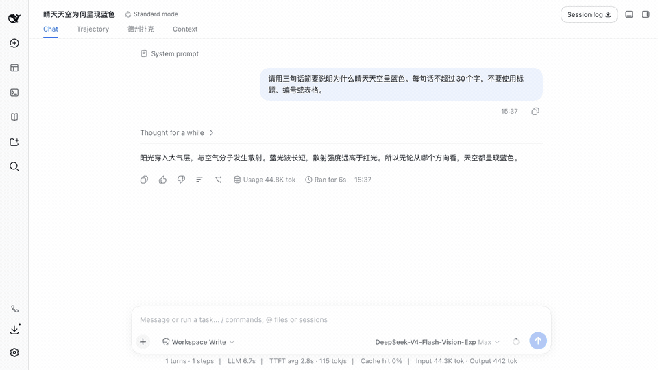

# dsh-quote-followup

[English](README.md) | 中文

[](https://www.npmjs.com/package/dsh-quote-followup)
[](LICENSE)

一个仅支持 Web 的 [DeepSeek Harness](https://github.com/deepseek-ai/deepseek-harness) 插件：选中对话文本，将其追加到输入框，再进行针对性追问。

<p align="center">
  
</p>

<p align="center"><strong>划选、引用、继续追问。</strong></p>

## 功能

- 在 Web 对话区选中文本后显示浮动的 **❐ 引用** 按钮。
- 以 DSH 原生对话引用 chip 追加到现有草稿，不覆盖已输入内容。
- chip 使用与 `@文件` / `@对话` 相同的 `ReferenceChipNode`、对话图标和业务色，可整体删除。
- chip 只展示摘录正文，引用语义由气泡图标表达，减少重复标签。
- 浮动按钮和发送时的引用框架跟随 DSH 当前语言。
- 选中内容来自 DSH 聊天行时，序列化引用会附带对话轮次编号，模型可定位"第 3 轮引用的内容"；无轮次标记时保持原有框架。
- 可连续引用多段内容；发送时由插件 codec 将各 chip 展开为模型可读的 Markdown 引用块。
- 旧版 DSH 缺少原生 chip 能力时，自动降级为纯文本引用。

本插件不再适配 TUI。

## 边界

这是一个 Web 客户端侧扩展。composer 和发送路径由浏览器 client 拥有：chip 只存在于 Lexical 编辑器中，模型只会看到发送时 codec 展开的 Markdown 引用块，永远不会看到 chip 本身，不涉及任何 host 侧插件接口。

chip 刻意只存文本：包含摘录正文、仅供显示的角色提示、可用的对话轮次编号和截断标记，不含全局 session-message 引用，因此在 compaction 折叠与会话轮转后依然有效。


## 安装

要求 DSH `>=0.1.2-rc.1`。

```bash
dsh plugin --profile web add dsh-quote-followup
```

将 `dsh-quote-followup` 加入 Web profile 的 `dsh.profile.bundles`，然后重启 `dsh web`，让服务端重新生成启动时缓存的 client bundle。重启后还需刷新或重新打开此前一直未关闭的浏览器页；旧页面已经加载的 JavaScript 不会从新服务进程自动更新。

## 使用

1. 在对话消息中划选任意片段。
2. 点击 **❐ 引用**。
3. 如需补充，可继续选中并引用其他片段。
4. 在引用 chip 后输入追问并发送。

## 开发验证

```bash
npm test
```

回归测试覆盖精简的原生引用 chip、中英文 locale 切换、轮次溯源与降级、连续引用、已有草稿后的间距、codec 序列化、Firefox 文本降级路径，以及热替换后新版 client 接管旧按钮/单例状态。

## 许可证

MIT
